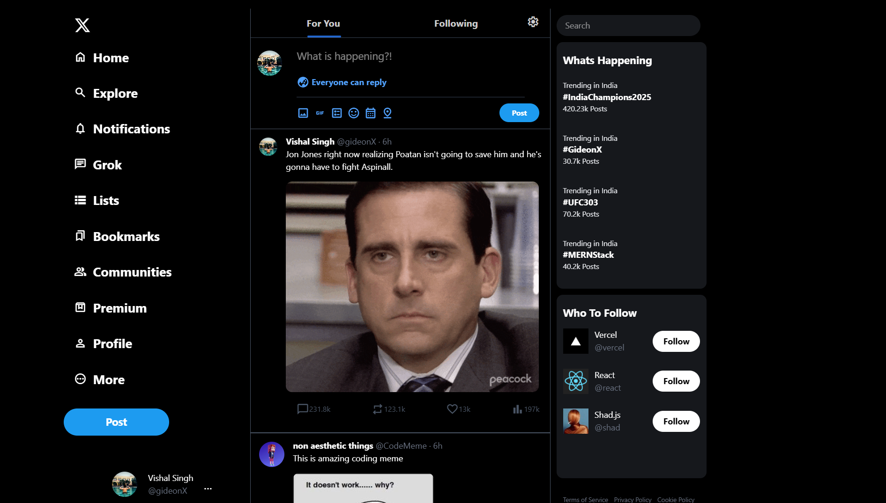

# X.com Clone

This project is a clone of the X.com social media platform, designed to mimic its layout and functionality using **Tailwind CSS**. The project aims to provide a similar user interface and experience as the original platform, showcasing advanced front-end development skills.

## Screenshots

Here are some screenshots of the project:

<p float="left">
  
  
  
</p>

## Features

- **Responsive Design**: The layout adjusts to different screen sizes, ensuring a seamless experience on both desktop and mobile devices.
- **Sidebar Navigation**: A sidebar with navigation links to different sections such as Home, Explore, Notifications, and more.
- **User Profile**: A user profile section displaying the user's avatar, name, and handle.
- **Post Creation**: An input area for users to create new posts with options to add images, GIFs, polls, and more.
- **Trending Section**: A section displaying trending topics and hashtags.
- **Who to Follow**: Suggestions for users to follow, including their profile pictures and follow buttons.
- **Posts Feed**: A feed displaying posts from different users with options to like, comment, and share.

## Technologies Used

- **Tailwind CSS**: For styling the web pages and making them responsive.
- **Google Fonts**: For icons and fonts used in the project.

## Getting Started

To get a local copy up and running, follow these simple steps:

### Prerequisites

- A web browser (e.g., Chrome, Firefox, Safari)
- Internet connection to load external resources (e.g., Google Fonts)

### Installation

1. Clone the repository:
    ```sh
    git clone https://github.com/your-username/x.com-clone.git
    ```
2. Navigate to the project directory:
    ```sh
    cd x.com-clone
    ```
3. Open the `index.html` file in your web browser to view the project.

## Usage

- Navigate through the sidebar to explore different sections.
- Create new posts using the input area in the main feed.
- View and interact with posts in the feed by liking, commenting, and sharing.

## Contributing

Contributions are what make the open-source community such an amazing place to learn, inspire, and create. Any contributions you make are **greatly appreciated**.

1. Fork the Project
2. Create your Feature Branch (`git checkout -b feature/AmazingFeature`)
3. Commit your Changes (`git commit -m 'Add some AmazingFeature'`)
4. Push to the Branch (`git push origin feature/AmazingFeature`)
5. Open a Pull Request

## License

Distributed under the MIT License. See `LICENSE` for more information.

## Contact

Vishal Singh - [@GID30N_x](https://x.com/GID30N_x) - mailtovishalsingh30@gmail.com

Project Link: [https://x-by-vs.netlify.app/](https://x-by-vs.netlify.app/)
